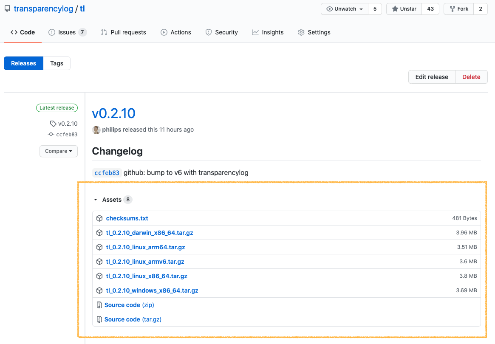

# Action to Publish and Verify Release Assets into Asset Transparency Log

This action adds all release assets for a project release on GitHub to the [Asset Transparency Log](https://www.transparencylog.com).

You or your users can then later verify GitHub is delivering the correct content to them using  Asset Transparency aware tools like [`tl get` or `tl verify`](https://github.com/transparencylog/tl#example-usage).

Encouraging your users to Asset Transparency log clients, like tl, provides an additional protection to your users against attacks that might modify release binaries or source code (e.g. GitHub account compromise, man in the middle, etc)

If you aren't familiar with release assets they are this section on a GitHub release page it is the page that looks like this:

## Inputs

**None**

## Outputs

### `verified`

The list of verified URLs

### `failed`

The list of URLs that failed to match the asset logs digest

## Example Workflow

[See example workflow](https://github.com/transparencylog/github-releases-asset-transparency-verify-action/blob/main/.github/workflows/asset-transparency.yaml)

### API Docs Used

- https://docs.github.com/en/actions/reference/context-and-expression-syntax-for-github-actions#github-context
- https://docs.github.com/en/actions/configuring-and-managing-workflows/using-environment-variables
- https://docs.github.com/en/actions/reference/events-that-trigger-workflows#release
- https://pkg.go.dev/github.com/google/go-github/v32/github?tab=doc#ReleaseEvent
